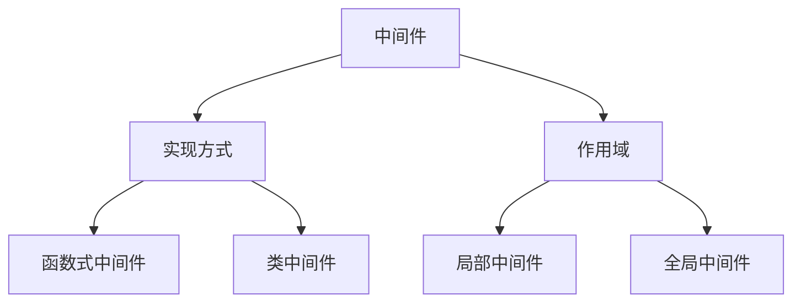

# Nest 核心概念

##  一. Nest 中的装饰器
### 1.1 类装饰器
* `@Controller`：用于装饰控制器类，使之能够管理应用中的路由程序，并通过设置路由路径前缀来模块化管理路由。
* `@Injectable`：装饰后成为服务提供者，可以被其他对象进行依赖注入。
* `@Module`：模块装饰器，用于在 `Nest` 中划分功能模块并限制依赖注入的范围。
* `@UseInterceptors`：用于绑定拦截器，将拦截器的作用范围限制在控制器类范围中（当然也可以作用在类的方法上）。

### 1.2 方法装饰器

* `@Get/@Post`：用于定义路由方法的 `HTTP` 请求方式。

### 1.3 属性装饰器

* `@IsNotEmpty/@IsString/@IsNumber`：用于在参数的验证场景中校验 `HTTP` 请求的参数是否符合预期。

### 1.4 参数装饰器

* `@Body/@Param/@Query`：用于接收 `HTTP` 请求发送的数据，不同的请求方式对应不同的参数接收方式。

## 二. 模块化

模块通过 `@Module` 装饰器来声明。每个应用都会有一个根模块，`Nest` 框架会从根模块开始收集各个模块之间的依赖关系，形式依赖关系树。

### 2.1 共享模块

使用`nest g resource User --no-spec` 和 `nest g resource Order --no-spec` 命令分别生成 `User` 和 `Order` 模块。

如果 `Order` 模块需要依赖 `User` 模块中的 `UserService`，这时可以将 `UserService` 添加到 `UserModule` 的 `exports` 中，使之成为共享服务。

1. 在 `User` 模块中导出 `User` 服务：

   ```typescript
   // user.module.ts
   import { Module } from '@nestjs/common';
   import { UserService } from './user.service';
   import { UserController } from './user.controller';
   
   @Module({
     controllers: [UserController],
     providers: [UserService],
     exports: [UserService], // 导出UserService，使其可以在其他模块中使用
   })
   export class UserModule {}
   ```

2. 在 `Order` 模块中导入 `User` 模块

   ```ts
   // order.module.ts
   import { Module } from '@nestjs/common';
   import { OrderService } from './order.service';
   import { OrderController } from './order.controller';
   import { UserModule } from 'src/user/user.module';
   
   @Module({
     imports: [UserModule],
     controllers: [OrderController],
     providers: [OrderService],
   })
   export class OrderModule {}
   ```

3. 在 `order.service.ts` 中通过属性注入 `UserServcie` 依赖

   ```typescript
   // order.service.ts
   import { Injectable, Inject } from '@nestjs/common';
   import { UserService } from 'src/user/user.service';
   
   @Injectable()
   export class OrderService {
     // 依赖注入之属性注入共享的服务
     @Inject(UserService) private userService: UserService;
   
     getOrderDesc(): string {
       // 使用 this.userService
     }
   }
   ```

   > 在 `order.service.ts` 中除了通过 `@Inject` 注入的方式，还可以通过构造函数：
   >
   > ```   typescript
   > constructor(private userService: UserService) {}
   > ```
   >
   > 或实例化 `UserService` 类：
   >
   > ```typescript
   > private userService: UserService = new UserService()
   > ```
   >
   > 来使用 `this.userService`。

### 2.2 全局模块

:::info

需要确保模块确实需要全局注入，以避免不必要的模块之间的耦合性。

:::

1. 在 `user.module.ts` 使用 `@Global` 装饰器将其声明为全局模块

   ```typescript
   // user.module.ts
   import { Module, Global } from '@nestjs/common';
   import { UserService } from './user.service';
   import { UserController } from './user.controller';
   
   @Global()
   @Module({
     controllers: [UserController],
     providers: [UserService],
     exports: [UserService], // 导出UserService，使其可以在其他模块中使用
   })
   export class UserModule {}
   ```

2. 在 `order.service.ts` 中通过属性注入 `UserServcie` 依赖。

### 2.3 动态模块 

`TODO`

## 三. 中间件



### 3.1 类中间件

类中间件通过使用 `@Injectable()` 装饰器来声明，并需要实现 `NestMiddleware` 接口的 `use` 方法。

实现一个 `logger.middleware.ts` 中间件：

```typescript
// logger.middleware.ts
import { Injectable, NestMiddleware } from '@nestjs/common';
import { Request, Response, NextFunction } from 'express';

// 这是类中间件
@Injectable()
export class LoggerMiddleware implements NestMiddleware {
  use(req: Request, res: Response, next: NextFunction) {
    console.log('before 类中间件');
    next();
    console.log('after 类中间件');
  }
}
```

TODO

### 3.2 函数式中间件

### 3.3 局部中间件

### 3.4 全局中间件

## 四. 拦截器与RxJS

### 4.1 拦截器

### 4.2 RxJS 常用 API

## 五. 管道

### 5.1 内置管道

#### 1. ParseIntPipe

#### 2. ParseFloatPipe

#### 3. ParseBoolPipe

#### 4. ParseUUIDPipe

#### 5. ParseEnumPipe

#### 6. DefaultValuePipe

#### 7. ParseArraypipie

#### 8. ValidationPipe

#### 9. ParseFilePipe

### 5.2 自定义管道

## 六. 文件上传

### 6.1 单文件上传

### 6.2 多文件上传 — 相同表单字段

### 6.3 多文件上传 — 不同表单字段

### 6.4 上传任意文件（不确定表单字段的情况）

### 6.5 文件验证


