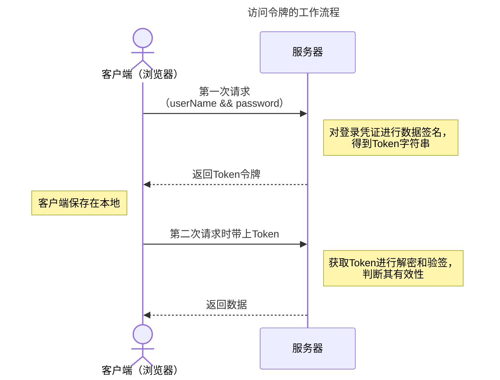
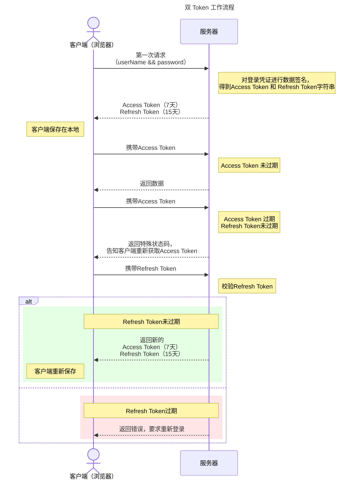
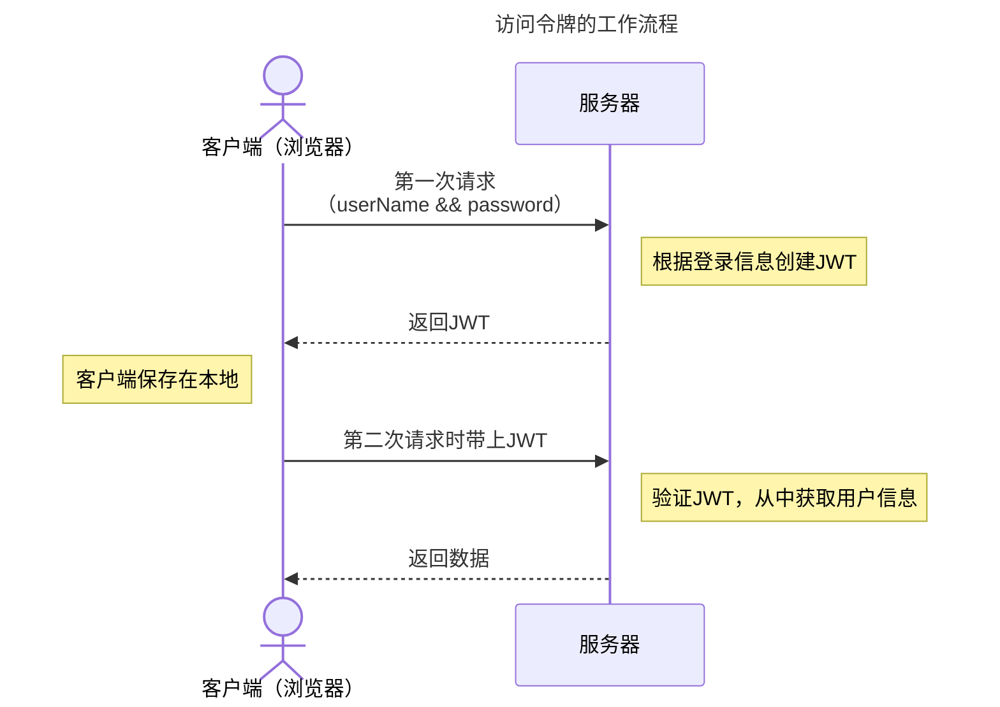
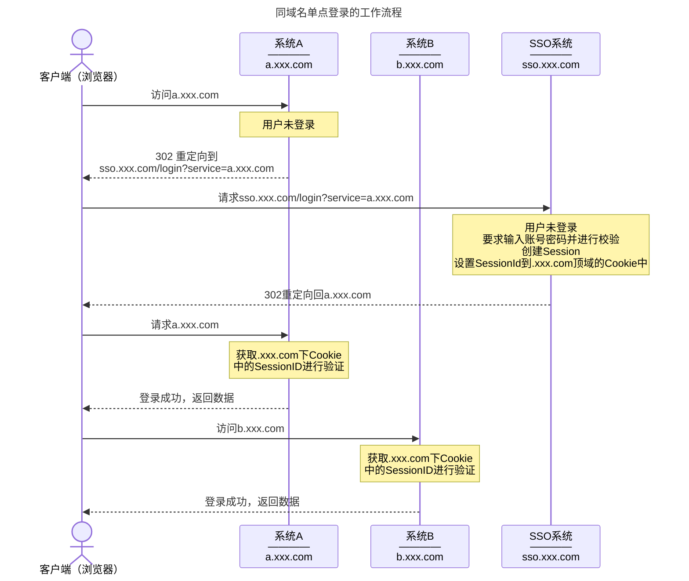
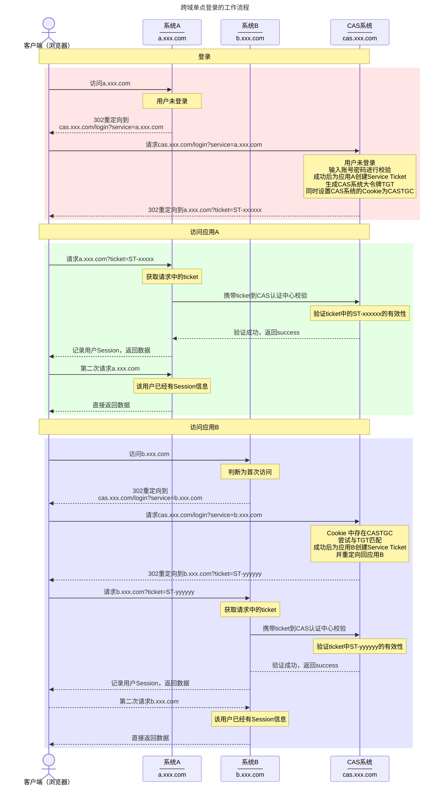

# 身份验证与授权
在应用程序中，身份验证是验证用户身份的过程，而授权是确定用户是否有权限执行特定操作的过程。

## 一、Cookie、Session、Token、JWT、SSO 详解

### 1.1 什么是身份验证

身份验证的通俗解释就是确认当前用户确实是其自称的那个人。

常见的身份验证方式有以下几种：

* 账号密码登录验证
* 手机短信验证
* 邮箱验证码验证
* 人脸识别验证
* 指纹登录验证

### 1.2 什么是授权

用户授予第三方应用访问某些资源的权限，称为授权。例如微信小程序询问是否允许访问昵称、微信名称等个人信息。

### 1.3 什么是凭证

实现身份验证和授权的前提是需要一种媒介来标识访问者的身份。当用户登录某个网站时，服务器会返回一个 `SessionID`（会话ID）或 `Token`（令牌）到用户浏览器中，用于标识当前用户的身份。再次请求访问网站时带上这个凭证，服务器才能识别出该用户的身份，并授予相应的操作权限。

### 1.4 什么是 Cookie

HTTP 协议是一种无状态协议，服务端在每次请求中无法识别请求是由哪个用户发起的。为了解决这个问题，需要一种机制来存储用户的身份信息，在后续请求时提供给服务器来识别是否为同一用户。这就需要用到 Cookie 了。

Cookie 存储在客户端浏览器中，由服务器发送并以文本文件形式存在，其大小通常限制在 4KB 以内。当用户再次向同一服务器发起请求时，Cookie 会被自动包含在请求头中并发送至服务器。需要注意的是，Cookie 不支持跨域访问，即每个 Cookie 都与特定域名绑定，无法被其他域名下的页面访问，但在相同域名下的页面直接可以共享使用。

由于 Cookie 存储在客户端，用户可以地查看和修改这些信息，这可能导致用户信息泄露，带来安全隐患。为了解决这一问题，通常会采用结合使用 Session 和 Cookie 的方法。在这种方法中，用户的敏感信息存储在服务端的 Session 中，而 Cookie 仅存储 Session 的标识符。这样，即使客户端的 Cookie 被访问，攻击者也无法直接获取到敏感的用户信息。

### 1.5 什么是 Session

Session 是另一种维持服务端与客户端的会话状态的机制，通常基于 Cookie 实现。Session 存储在服务端中，而 SessionID 存储在客户端的 Cookie 字段中。

### 1.6 Session 与 Cookie 的区别

Session 与 Cookie 在 Web 程序中的不同用途和实现方式决定了它们之间存在以下区别：

* 存储位置：Cookie 通常以文本形式存储在客户端浏览器中，而 Session 数据则存储在服务端，可能是数据库或内存中，可以以任意类型存在。
* 安全性：由于 Cookie 存储在客户端，因此可以被用户查看和修改，存在安全风险。相比之下，Session 数据存储在服务端，用户无法直接访问和修改，因此相对更安全，不过，Session 仍可能面临 CSRF（Cross-Site Request Forgery，跨站请求伪造）攻击的风险，这种攻击经常通过钓鱼网站进行。
* 生命周期：Cookie 可以设置一个较长的有效期，实现如默认登录等功能，而 Session 的生命周期通常较短，会在客户端关闭或 Session 超时后失效（默认情况下）。
* 存储大小：单个 Cookie 的数据存储大小通常限制在 4KB 以内，而 Session 所能存储的数据量远大于 Cookie，没有 4KB 的限制。

结合使用 Session 和 Cookie 的方案相较于仅使用 Cookie 具有明显优势，但它并非没有缺陷。除了容易受到 CSRF（跨站请求伪造）攻击之外，Session 由于存储在服务端，还面临一些挑战。特别是在多服务器环境中，当出现高并发时，用户的请求可能会被负载均衡器分配到不同的服务器上。如果用户的 Session 信息仅保存在一台服务器上，那么其他服务器将无法访问该 Session 信息，从而导致会话管理问题。

为了解决这一问题，通常需要采用特殊的方案在多台服务器之间同步 Session 信息。一种常见的做法是使用像 Redis 这样的分布式缓存系统来存储 Session 数据，以确保所有服务器都能访问到最新的用户会话状态。

除了 Session 和 Cookie 的结合使用，我们还可以考虑使用 Token（如 JWT）来实现服务端的无状态化。无状态化意味着用户的会话信息被编码在 Token 中，每次请求时由客户端发送，服务端通过解析 Token 来验证用户身份，无须在服务端存储 Session 信息。

### 1.7 什么是 Token

Token 是访问受限资源时需要携带的一种凭证，通常是一个加密字符串，常见的 Token 有以下两种。

#### 1.7.1 访问令牌

访问令牌（Access Token）是一种用于授权用户访问特定资源或执行特定操作的凭证。

#### 1.7.2 刷新令牌

刷新令牌（Refresh Token）是专门用于刷新访问令牌的Token，它的有效期通常比访问令牌长，以保证用户登录状态的持久性。

### 1.8 什么是 JWT

JWT 是一种特殊的 Token。JWT 允许在用户和服务端之间传递经认证的用户信息，而无需暴露用户的认证凭据。

### 1.9 JWT 和 Token 的区别

#### 共同点

* **访问资源的令牌**

* **记录用户认证信息**

* **服务端无状态化**：两者都支持服务端的无状态化，即服务端不需要存储会话信息

* **跨域资源共享**：JWT 和 Token 都能够支持跨域资源共享（Cross-Origin Resource Sharing，CROS）

  :::warning

  **Token 本身并不是跨域资源共享的，而是 Token 机制能够更好地支持跨域场景。**

  “Token 适合跨域”是因为对比传统的**Session-Cookie机制**，Token 机制在跨域场景中**更容易实现和安全**。

  Token 跨域只需要手动通过请求头发送即可；

  而传统Cookie存在以下限制：

  1. Cookie 默认不能跨域访问
  2. 需要设置CROS头部
  3. 需要设置Cookie的SameSite属性
  4. 需要处理CSRF防护
  5. 需要配置复杂的domain/path
  6. 移动端支持差，处理复杂
  7. 多域名共享需要子域名单独设置Cookie

  :::

#### 区别

* **鉴权机制**：传统 Token 鉴权通常需要服务端解析客户端发送的 Token，并根据该 Token 去**数据库查询**用户信息，以此验证 Token 的有效性；而JWT只需要验证签名和过期时间，如果都有效，则直接解析Payload获取用户信息。
* **多样性**：Token 可以采取多种形式，例如随机字符串，OAuth 令牌、Session Token（Session-Cookie 机制） 等。而 JWT 是 Token 的一种具体实现形式。
* **信息存储与加密**：JWT 在发行时会将用户信息加密并存储在 Token 自身中，客户端携带 JWT 进行请求，服务端通过密钥进行解密校验，无须再次查询数据库。 

### 1.10 什么是 SSO

SSO（Single Sign On，单点登录）是在多个应用系统中，只需要登录一次，就可以访问其他相互信任的应用系统。

单点登录有两种情况，一是多个应用系统在同一域名下，子系统通过二级域名来区分；另一种是多个应用系统分布在不同域名下。

#### 1. 同域名下的单点登录 ?

企业通常拥有一个主域名，并利用二级域名来区分其不同的子系统。例如，如果企业的顶级域名是 xxx.com，那么业务系统 A 和 B 可能分别位于 a.xxx.com 和 b.xxx.com。为了实现单点登录，企业需要一个集中的登录系统，比如位于 sso.xxx.com。

在单点登录机制下，用户只需要在 sso.xxx.com 进行一次登录，随后便能无缝访问系统A和B，无须重复登录。这种登录认证机制允许用户在多个相关联的系统间自由切换，同时保持会话的连续性。

:::warning

SSO、系统A和系统B是不同的应用，它们的 Session 存储在自己的服务器上，并不默认共享。等用户登录 SSO 系统后，若要访问系统A，系统A需要能够识别和验证SSO系统设置的Cookie中的SessionID。

为了解决这一问题，可以采用如 Redis 这样的工具来实现 Session 的共享。

此外，也可以使用 Token 机制来维护用户的认证信息，Token 由客户端存储，从而是使服务端达到无状态化。

:::

#### 2. 不同域名（跨域）下的单点登录

采用中央认证服务（Central Authentication Service，CAS）来集中管理身份认证 。

## 二、基于 Passport 和 JWT 实现身份验证

## 三、基于 RBAC 实现权限控制